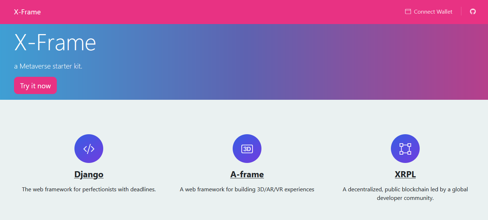

# X-Frame
a Metaverse starter kit that combines Django, A-Frame and XRPL.

[Demo available here](https://xframe.trilab.dev)



## Environment setup
Set the following environment variables in your system. 
These variables are used by the `xframe/settings.py` file.

| Environment variables  |                                                     |
|------------------------|-----------------------------------------------------|
| POSTGRES_USER          | the user of the postgres database                   |
| POSTGRES_PASSWORD      | the password of the postgres database               |
| POSTGRES_DB            | the name of the postgres database                   |
| POSTGRES_HOST          | the hostname of the postgres database               |
| POSTGRES_PORT          | the port of the postgres database                   |
| SECRET_KEY             | a unique, unpredictable string                      |
| DEBUG                  | set True for development, False for production mode |
| XUMM_API_KEY           | the api key provided by Xumm                        |
| XUMM_API_SECRET        | the secret key provided by Xumm                     |

You can ignore the POSTGRES variables if you are using the sqlite database. 
You can do so by defining the sqlite engine in the `xframe/settings.py` file:
```
DATABASES = {
    "default": {
        "ENGINE": "django.db.backends.sqlite3",
        "NAME": "mydatabase",
    }
}
```

## Installation
In the project root launch the following commands:
```
pip3 install -r requirements.txt
python manage.py makemigrations
python manage.py migrate
python manage.py runserver "0.0.0.0:80" --settings=xframe.settings
```